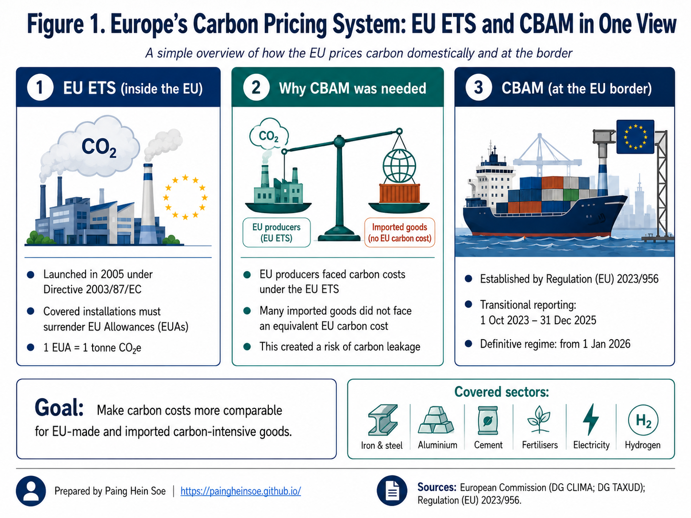
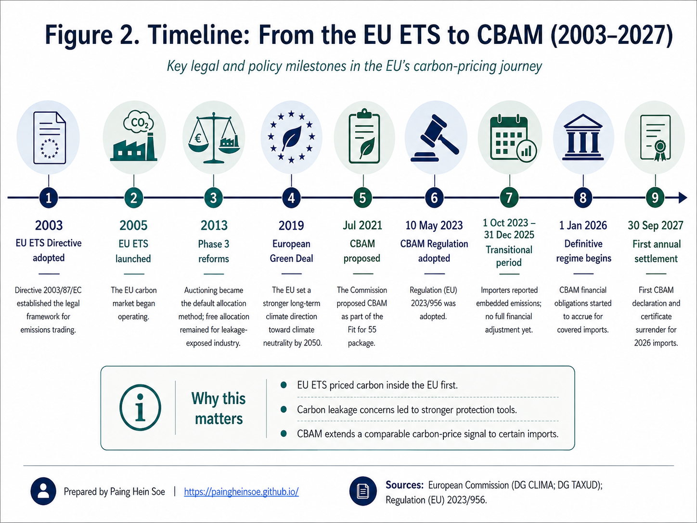
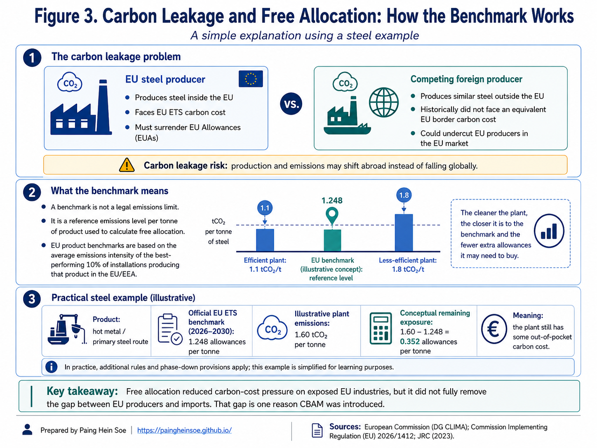
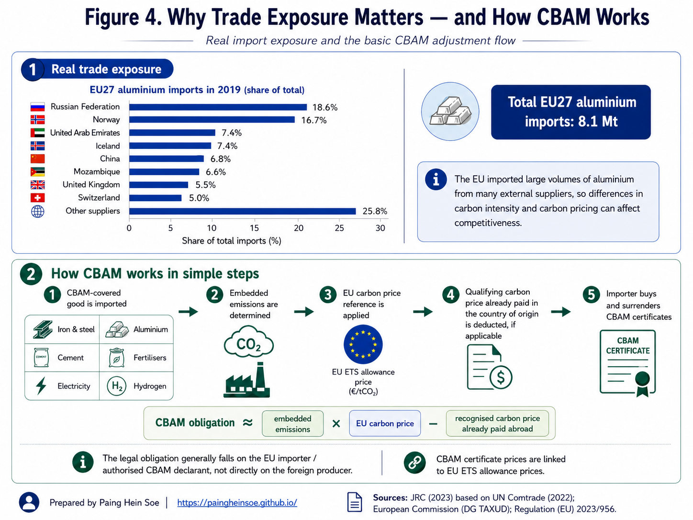

CBAM is one of those policies that sounds simple at first: *put a carbon price on certain imports*. But once terms such as **EUAs, carbon leakage, free allocation, benchmarks, embedded emissions, and CBAM certificates** start appearing together, the picture can become surprisingly difficult to follow.

When I started breaking CBAM down, I found that the clearest way to understand it was not to begin at the border. It was to follow the policy in the order it developed.

Europe first created the **EU Emissions Trading System (EU ETS)** and put a price on emissions from major parts of its own economy. That raised a practical question:

> **What happens when a producer inside the EU pays for carbon, while a competing imported product does not face an equivalent carbon cost?**

That question connects the main pieces of the story: **carbon leakage, free allocation, industrial benchmarks, and finally the Carbon Border Adjustment Mechanism (CBAM)**.

I have organized the article in two parts. **Part I** explains why CBAM emerged. **Part II** then looks at how the mechanism works in practice and what it means for importers, exporters, carbon pricing, and industrial decarbonisation.

::: {.callout-note}
**What I hope this article helps you understand**

- how the EU ETS creates a carbon price inside Europe;
- why carbon leakage became a concern for traded, emissions-intensive products;
- what free allocation and industrial benchmarks actually do;
- why CBAM was added instead of relying on free allocation indefinitely; and
- how embedded emissions, CBAM certificates, and carbon prices paid abroad fit together.
:::

**I use Figure 1 as a map of the whole story.** Read it from left to right. The EU ETS prices emissions inside Europe. Differences in carbon costs create a leakage concern. CBAM then brings a comparable carbon-price signal to covered imports at the EU border.

{fig-alt="Overview of the EU ETS inside the European Union, the carbon leakage concern, and CBAM applying to covered imports at the EU border." fig-align="center" width="100%"}

---

::: {.callout-note}
**Part I: Why CBAM emerged**

Start with the EU ETS, then follow the problem it created for trade-exposed industries, the role of free allocation, and why a border mechanism was introduced.
:::

## 1. The bigger picture: EU ETS and CBAM are connected

The most important starting point is this:

> **CBAM did not replace the EU ETS. It was designed to complement it.**

The two mechanisms operate at different points in the system.

| | EU ETS | CBAM |
|---|---|---|
| **Where?** | Mainly within the European carbon market | At the EU border for covered imports |
| **What is priced?** | Emissions from covered installations and operators | Embedded emissions in covered imported goods |
| **Compliance instrument** | EU Allowance (EUA) | CBAM certificate |
| **Main legal instrument** | Directive 2003/87/EC | Regulation (EU) 2023/956 |

The EU ETS Directive was adopted in **2003**, and the system began operating in **2005**. CBAM came much later. Its regulation was adopted in **2023**, followed by a transitional reporting period from October 2023 through the end of 2025 and the definitive regime from **1 January 2026**.

That twenty-year gap is important. CBAM was not introduced as an isolated trade measure. It grew out of questions that became more important as Europe’s domestic carbon-pricing system matured.

**I use Figure 2 as the historical map for the rest of Part I.** It shows the sequence clearly: the EU first developed its domestic carbon market, strengthened it over time, and only later added CBAM as part of the wider climate-policy framework.

{fig-alt="Timeline showing major milestones from the EU ETS Directive in 2003 through the launch of the EU ETS, CBAM legislation, the definitive regime, and the first annual settlement." fig-align="center" width="100%"}

## 2. How does the EU ETS put a price on emissions?

The EU ETS is a **cap-and-trade system**, not simply a carbon tax.

I find it helpful to think about the basic mechanism in three steps:

1. **Set the cap:** the EU limits the total emissions available to covered activities.
2. **Create allowances:** the cap is represented by tradable EU Allowances, or **EUAs**.
3. **Meet the obligation:** covered companies must use enough allowances to cover their verified emissions. In the legal language of the ETS, this final compliance step is called **surrendering allowances**.

One EUA represents one tonne of carbon-dioxide equivalent:

$$
1\ \mathrm{EUA} = 1\ \mathrm{tCO_2e}
$$

So if an installation reports **100,000 tCO₂e** of verified emissions, it ultimately needs **100,000 allowances**.

::: {.callout-tip}
**Why does this create a carbon price?**

Allowances are limited and tradable. If reducing one tonne of emissions costs less than obtaining the allowance needed for that tonne, reducing emissions can become financially attractive. Continuing to emit means continuing to manage the allowance cost.
:::

The cap also becomes tighter over time. Under the current framework, the EU ETS is intended to reduce emissions from covered sectors by **62% by 2030 compared with 2005 levels**.

Today, the system covers electricity and heat generation, major industrial activities, aviation and maritime transport and accounts for roughly **40% of total EU greenhouse-gas emissions**.

So the domestic logic is fairly intuitive. The EU limits total emissions, allowances become scarce, and trading gives those allowances a market price.

The complication begins when firms subject to that carbon price compete in international markets.

## 3. Why carbon-intensive traded products matter

Carbon pricing does not affect every product equally.

For industries such as **steel, aluminium, and cement**, emissions and energy use can be large enough that carbon pricing becomes a meaningful production cost. These products are also traded internationally at large scale.

Two examples make that concrete:

| Example | Why carbon matters |
|---|---|
| **Primary steel** | A 2023 JRC analysis estimated about **2.28 tCO₂ per tonne of steel** for the primary route under comparable analytical boundaries. |
| **Primary aluminium** | The same JRC analysis used about **14.79 MWh of electricity per tonne** under its EU+EFTA modelling assumptions, in addition to carbon anodes used in the Hall–Héroult process. |

The aluminium example is especially useful because electricity supply can differ dramatically from one producing country to another. Two plants can make broadly the same product but have very different carbon intensities.

That is where carbon policy begins to interact with **international competitiveness**.

## 4. The carbon-leakage problem

Imagine two producers selling similar steel into the same European market.

| EU producer | Competing foreign producer |
|---|---|
| Produces inside the EU | Produces outside the EU |
| Covered by the EU ETS | May face a lower or no comparable carbon price |
| Carbon enters production cost through the ETS | Carbon cost may be lower |

The concern is not simply that the EU producer pays more.

If that cost difference causes production or investment to move outside Europe, global demand for steel has not disappeared. The steel may simply be produced somewhere else. A similar effect can occur if EU production is replaced by more carbon-intensive imports.

That is the basic idea of **carbon leakage**: emissions may shift rather than genuinely fall.

::: {.callout-note}
**One important qualification**

Carbon leakage is not usually a number that can simply be observed in a database. Much of the analysis is **counterfactual**: researchers must estimate what production, trade, and emissions would have looked like under different policy conditions.

For context, an OECD study covering **14 manufacturing sectors and 49 countries** estimated a median leakage rate of around **3%** and an average of around **14%**, with greater exposure in some emissions-intensive sectors. These are not a single “EU leakage rate”; they show that leakage risk can vary substantially by sector and economy.
:::

Trade volumes show why the issue can matter commercially. The JRC estimated that the EU27 imported around **8.1 million tonnes of aluminium in 2019**, supplied by a wide range of external producers.

But CBAM was not the EU’s first response.

## 5. The first response: free allocation

The EU ETS has historically used **free allocation** to reduce some of the carbon-cost pressure on industries exposed to international competition.

The easiest way to understand it is to separate what free allocation **does** from what it **does not do**.

| Free allocation **does** | Free allocation **does not** |
|---|---|
| Give an eligible installation some EUAs without an upfront purchase | Remove the installation from the EU ETS |
| Reduce part of the plant’s out-of-pocket carbon-cost exposure | Make the plant’s actual emissions disappear |
| Help manage carbon-leakage risk | Automatically cover every tonne the plant emits |

The installation still measures its emissions and must provide enough allowances to meet its annual compliance obligation.

So the next question becomes more interesting:

> **If allowances are given free, how does the EU decide how many a plant should receive?**

Simply giving a plant more free allowances because it emits more would weaken the incentive to become more efficient.

That is why the system uses **benchmarks**.

## 6. What does an ETS benchmark actually mean?

An ETS benchmark is a **reference emissions-performance level used in calculating free allocation**.

It is not a legal emissions ceiling.

::: {.callout-warning}
**Common misunderstanding: benchmark ≠ emissions limit**

A plant can emit above the benchmark. It simply still needs enough allowances to cover its actual emissions. The benchmark helps calculate free allocation; it does not define the maximum amount the plant is legally allowed to emit.
:::

Imagine three plants producing the same product:

- Plant A: **1.1 tCO₂/t product**
- Plant B: **1.5 tCO₂/t product**
- Plant C: **1.9 tCO₂/t product**

Instead of asking, *Which plant emits the most?*, the benchmark approach asks:

> **What emissions performance is already being achieved by the more efficient installations producing this product?**

EU product benchmarks are developed using emissions-intensity performance from the **10% most greenhouse-gas-efficient installations** producing the relevant product.

There is one technical refinement worth keeping in mind. The legally applicable benchmark for an allocation period is **not necessarily numerically identical to the latest average of that top-performing 10%**. Those performance data feed into a regulatory benchmark-update methodology that also applies prescribed reduction rules.

For **2026–2030**, some current legal benchmark values are:

| EU ETS product benchmark | 2026–2030 value |
|---|---:|
| Hot metal | **1.248 allowances/t** |
| Aluminium | **1.423 allowances/t** |
| Grey cement clinker | **0.656 allowances/t** |
| EAF carbon steel | **0.142 allowances/t** |

These values should not be compared casually across products because process boundaries and the treatment of inputs such as electricity differ.

**Figure 3 pulls three ideas together:** the competitive problem, the benchmark concept, and an illustrative steel calculation. The middle panel is especially useful: it shows why the benchmark is a reference point rather than an emissions ceiling.

{fig-alt="Illustration comparing an EU steel producer and a foreign producer, explaining carbon leakage, the EU ETS benchmark, and an illustrative steel free-allocation calculation." fig-align="center" width="100%"}

## 7. Putting the benchmark into numbers: a steel example

The benchmark becomes easier to understand when we put numbers around it.

Consider an **illustrative integrated steelworks** producing hot metal. The plant is hypothetical, but the benchmark is the official **2026–2030 hot-metal benchmark**.

### Assumptions

| Item | Illustrative value |
|---|---:|
| Annual hot-metal production | **100,000 t** |
| Actual emissions intensity | **1.60 tCO₂/t** |
| Hot-metal benchmark | **1.248 allowances/t** |
| 2026 CBAM factor | **97.5%** |

### Step 1: Actual emissions

$$
100{,}000 \times 1.60
=
160{,}000\ \mathrm{tCO_2}
$$

### Step 2: Illustrative free allocation

Ignoring other installation-specific adjustments:

$$
100{,}000 \times 1.248 \times 0.975
\approx
121{,}680\ \mathrm{free\ EUAs}
$$

### Step 3: Remaining allowance requirement

$$
160{,}000 - 121{,}680
=
38{,}320\ \mathrm{EUAs}
$$

The plant has therefore received substantial protection, but its carbon exposure has **not disappeared**.

For scale, the published CBAM certificate price for **Q2 2026 was €75.28/tCO₂**. If an EUA were valued at approximately the same level purely for illustration, 38,320 allowances would correspond to roughly **€2.9 million**.

::: {.callout-tip}
**What this example is showing**

Free allocation can materially reduce carbon-cost exposure, but it does not turn the EU ETS into a zero-cost system for the plant.

The example is for learning purposes only; real allocation calculations can involve additional regulatory and installation-specific factors.
:::

## 8. Why free allocation was not the final solution

Free allocation helped with competitiveness, but it did not remove the underlying difference between EU production and imported production.

The broad picture was still uneven:

| EU production | Covered imports |
|---|---|
| Faced an EU ETS carbon obligation, partly protected by free allocation | Historically did not face an equivalent EU ETS obligation at the EU border |

There was also a policy tension: maintaining large amounts of free allocation indefinitely would weaken part of the carbon-price signal intended to encourage cleaner industrial production.

This is the bridge to CBAM.

| As CBAM is phased in | What changes? |
|---|---|
| Free allocation for CBAM sectors | **Gradually decreases** |
| Carbon-price exposure for covered imports | **Gradually increases** |

Under the legislation currently in force, the CBAM factor declines from **97.5% in 2026**, to **95% in 2027**, **90% in 2028**, **77.5% in 2029**, and progressively further until no CBAM factor applies from **2034**.

So this is not a sudden switch from one system to another. It is a gradual transition from **protecting EU industry mainly through free allocation** toward **applying a more comparable carbon-price signal to covered domestic and imported production**.

---

::: {.callout-note}
**Part II: How CBAM works in practice**

Once the policy history is clear, the practical questions become easier: what emissions are counted, who is responsible, how certificates are priced, and what happens when carbon has already been priced abroad?
:::

## 9. CBAM brings embedded emissions into the picture

CBAM was established by **Regulation (EU) 2023/956**.

Its transitional period began on **1 October 2023**, when the main requirement was emissions reporting. The definitive regime began on **1 January 2026**.

CBAM currently covers selected goods in six areas:

**cement · iron and steel · aluminium · fertilisers · electricity · hydrogen**

The key word is **embedded**.

CBAM is concerned not only with how many tonnes of a product enter Europe, but with the greenhouse-gas emissions associated with producing those goods under the applicable CBAM methodology.

The legal responsibility generally falls on the **authorised CBAM declarant**, usually the EU importer or, in some circumstances, an indirect customs representative.

A simplified CBAM flow is:

1. a covered good enters the EU;
2. its embedded emissions are determined;
3. the EU carbon-price reference is applied;
4. qualifying carbon prices already effectively paid abroad can be taken into account; and
5. the authorised declarant ultimately submits the required CBAM certificates to settle the annual obligation.

**I use Figure 4 to connect the policy to a real trade context.** The upper section shows how exposed the EU aluminium market is to external suppliers. The lower section follows the CBAM process from import through to the final certificate-compliance step.

{fig-alt="EU aluminium import exposure followed by a simplified explanation of how CBAM determines embedded emissions, applies an EU carbon-price reference, recognises qualifying foreign carbon prices, and requires certificate submission for compliance." fig-align="center" width="100%"}

## 10. What sets the price of a CBAM certificate?

The certificate price is tied to the **EU ETS carbon price**.

For 2026, the European Commission calculates a quarterly certificate price from EU ETS auction information:

| Quarter | Published CBAM certificate price |
|---|---:|
| Q1 2026 | **€75.36/tCO₂** |
| Q2 2026 | **€75.28/tCO₂** |

From 2027, the calculation moves to a weekly basis.

The dates can be confusing because the **definitive regime starts in 2026**, while the first certificate purchase and annual compliance cycle follows later.

::: {.callout-important}
**2026 liability does not mean certificates are settled in 2026**

- **1 Jan 2026:** the definitive CBAM regime applies to covered imports.
- **From Feb 2027:** certificates corresponding to 2026 embedded emissions become available for purchase through the common central platform.
- **30 Sep 2027:** the first annual CBAM declaration is due, and the required certificates for 2026 imports must be submitted for compliance under the current timetable.

So the carbon obligation attaches to 2026 imports, but the first annual settlement follows in 2027.
:::

## 11. What if carbon has already been priced abroad?

A reasonable question is:

> **If the exporting country already charges a carbon price, does the EU simply charge for the same carbon again?**

Not necessarily.

CBAM allows an authorised declarant to take account of a qualifying carbon price that has already been **effectively paid in the country of origin**, subject to the applicable rules and evidence. Rebates and compensation also matter when determining the amount effectively paid.

A simple illustrative example:

| | Amount |
|---|---:|
| EU-equivalent carbon exposure | **€100** |
| Recognised carbon price already paid abroad | **− €35** |
| Illustrative remaining exposure | **€65** |

The €35 is **not transferred from the foreign government to the EU**. It remains within the foreign carbon-pricing system; recognition of that price reduces the remaining CBAM obligation.

::: {.callout-note}
**Why this matters beyond Europe**

For an exporting country, credible domestic carbon pricing can have a trade dimension. If a qualifying carbon price is recognised under CBAM, more of the carbon-pricing revenue can remain within the exporting economy rather than leaving the full adjustment to take place at the EU border.

That does not mean every foreign climate policy automatically qualifies. The details of the price, rebates, verification, and supporting evidence matter.
:::

## 12. Where does the carbon money go?

It helps to keep three different things separate.

| Instrument | What happens financially? |
|---|---|
| **Auctioned EUA** | A company buys an allowance; the auction generates public revenue. |
| **Free EUA** | The allowance is initially allocated without an auction purchase; it remains a compliance asset. |
| **CBAM certificate** | An authorised declarant purchases certificates through the CBAM system and later uses the required amount to settle the annual obligation. |

### EU ETS auction revenue

In **2024**, EU ETS auctions generated approximately **€38.8 billion**. About **€24.4 billion** went directly to Member States, while the remainder supported EU-level mechanisms including the **Innovation Fund**, **Modernisation Fund**, and the Recovery and Resilience Facility associated with REPowerEU.

In practical terms, auctioning turns allowances into **public revenue**, and the relevant budget rules then determine how that revenue supports climate and energy-transition purposes.

It is not a direct one-to-one payment from an emitting company to a particular wind farm or solar project.

### CBAM revenue

CBAM certificates are likewise part of a public compliance mechanism. The broader fiscal treatment of CBAM revenues within the EU budget is a separate question from the mechanism that determines an importer’s compliance obligation.

A useful distinction is:

> **The carbon-pricing rule determines what has to be paid. Budget rules determine what happens to the resulting public revenue.**

## 13. What I hope you take away from this article

For me, CBAM becomes much easier to understand once it is treated as the next stage of a longer policy story rather than as a stand-alone “green tariff.”

::: {.callout-tip}
**Five points worth remembering**

1. **The EU ETS came first.** Europe began pricing covered domestic emissions in 2005.
2. **Trade created a difficult policy question.** Carbon costs can affect competitiveness when imported goods face different carbon-pricing conditions.
3. **Free allocation became an important protection.** It reduced some carbon-cost exposure for leakage-exposed EU industry, but it did not remove the ETS obligation.
4. **Benchmarks are reference points, not emissions ceilings.** They help determine free allocation.
5. **CBAM changes the border side of the system.** Covered imports increasingly face a carbon-price signal linked to the EU ETS as free allocation for corresponding EU sectors is reduced.
:::

I find three questions especially useful for keeping the whole system straight:

| Question | Main policy response |
|---|---|
| How does Europe put a price on emissions from covered domestic activities? | **EU ETS** |
| How has the EU tried to reduce the risk that emissions-intensive production shifts elsewhere? | **Free allocation and other carbon-leakage protections** |
| How are covered imports treated when producers may face different carbon-pricing conditions? | **CBAM** |

Once those three pieces are clear, the harder questions become much easier to approach: **How are embedded emissions calculated? Which exporters and economies are most exposed? How will CBAM interact with carbon pricing outside Europe? And what might it mean for individual sectors such as steel, aluminium, cement, and fertilisers?**

Those are natural directions for the next articles in this series.

::: {.callout-warning}
**Policy status: August 2026**

The EU ETS and CBAM are still evolving.

Under the legislation currently in force, the CBAM factor reduces free allocation for CBAM-covered sectors through 2033, with no CBAM factor applying from **2034**.

On **17 July 2026**, however, the European Commission proposed a targeted revision of the EU ETS. The proposal would reintroduce part of the free allocation phased out through the CBAM factor from 2028 and delay the complete phase-out of free allocation for CBAM sectors to **2038**.

At the time of writing, this remains a **legislative proposal, not adopted law**. The article therefore keeps the rules currently in force separate from proposed future changes.
:::

## Sources and further reading

The main sources used for this article include:

- [European Commission: About the EU Emissions Trading System](https://climate.ec.europa.eu/areas-action/carbon-markets/about-eu-ets_en)
- [European Commission: Carbon Border Adjustment Mechanism](https://taxation-customs.ec.europa.eu/carbon-border-adjustment-mechanism_en)
- [European Commission: Price of CBAM certificates](https://taxation-customs.ec.europa.eu/carbon-border-adjustment-mechanism/price-cbam-certificates_en)
- [European Commission: ETS revenues and their use](https://climate.ec.europa.eu/areas-action/carbon-markets/eu-emissions-trading-system-eu-ets/what-are-ets-revenues-used_en)
- [Directive 2003/87/EC: EU ETS legal framework](https://eur-lex.europa.eu/legal-content/EN/TXT/PDF/?uri=CELEX:02003L0087-20240301)
- [Regulation (EU) 2023/956: CBAM legal framework](https://eur-lex.europa.eu/eli/reg/2023/956/oj)
- [Commission Implementing Regulation (EU) 2026/1412: 2026–2030 ETS benchmarks](https://eur-lex.europa.eu/eli/reg_impl/2026/1412/oj/eng)
- [European Commission Joint Research Centre: Greenhouse gas emission intensities of the steel, fertilisers, aluminium and cement industries](https://publications.jrc.ec.europa.eu/repository/handle/JRC134682)
- [OECD: How different climate policies affect carbon leakage through trade](https://www.oecd.org/en/publications/how-different-climate-policies-affect-carbon-leakage-through-trade_5819ce91-en.html)
- [European Commission proposal COM(2026) 616: proposed revision of the EU ETS](https://eur-lex.europa.eu/legal-content/EN/TXT/HTML/?uri=COM:2026:616:FIN)

*This article is intended as a learning and policy-analysis resource. It is not legal, customs, tax, or regulatory-compliance advice.*

## A personal note

Thanks for reading. I hope this article has made the path from the EU ETS to CBAM clearer, especially the parts that can be easy to mix up, such as **carbon leakage, free allocation, benchmarks, embedded emissions, and CBAM certificates**.

I am continuing this topic as a series, with later articles going deeper into questions such as embedded-emissions calculations, sector-specific exposure, and what CBAM may mean for exporters and carbon pricing outside the EU.

If you have a question, comment, or a different perspective worth discussing, feel free to reach out to me through **LinkedIn or email using the contact details on my portfolio**. I would be glad to hear from you.

