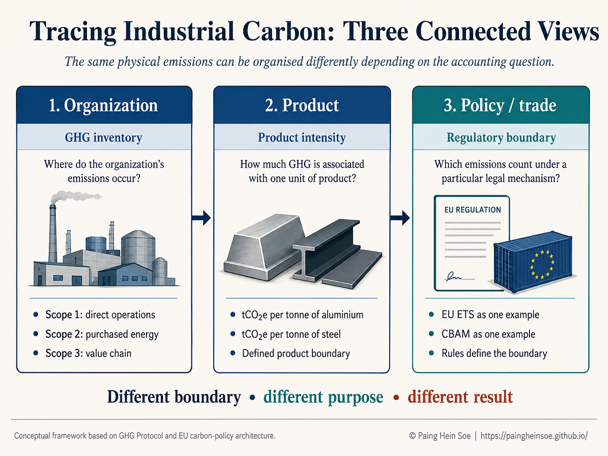
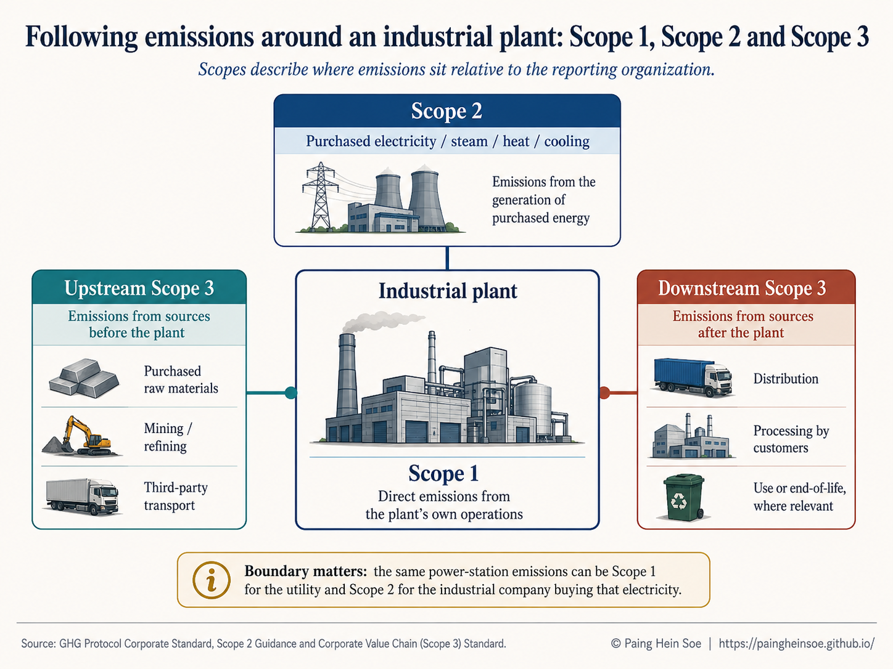
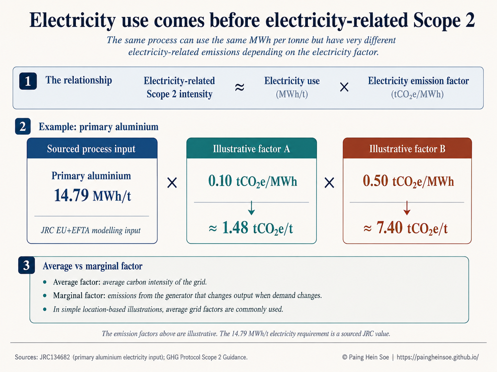
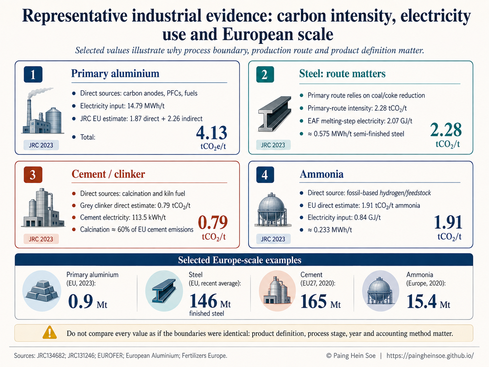

Industrial carbon is often reduced to a single number, such as *tonnes of CO$_2$ per tonne of steel, aluminium or cement*. That number is useful, but it can hide an equally important question: **where did those emissions actually occur?**

Some emissions are released directly inside the plant. Others arise from the electricity used to run the process. Still others occur upstream or downstream in the value chain.

When I started comparing industrial products more closely, I found that **Scope 1, Scope 2 and Scope 3 became much easier to understand once I followed the physical production process instead of starting with the accounting definitions alone**.

A primary aluminium smelter, a conventional steelworks, a cement kiln and an ammonia plant can all be carbon-intensive, but for different reasons. This article follows those differences from the organization to the product, and then to the wider industrial and policy context.

::: {.callout-note appearance="simple"}
## What this article helps you understand

- what Scope 1, Scope 2 and Scope 3 actually describe;
- how organizational emissions become product-level intensities such as tCO$_2$e/t;
- why electricity use should be understood before interpreting Scope 2;
- how aluminium, steel, cement and ammonia differ physically;
- why both emissions intensity and production scale matter; and
- why corporate, product and regulatory carbon boundaries are related but not identical.
:::

I use @fig-three-views as the map for the article. Read it from left to right: **organization**, **product**, then **policy or trade**.

{#fig-three-views fig-alt="Three connected views of industrial carbon: organization, product, and policy or trade"}

---

::: {.callout-note appearance="simple"}
## Part I: From the organization to the product

First locate emissions around the reporting organization. Then translate the relevant emissions into a product-level intensity.
:::

## 1. The bigger picture: three accounting views

Before comparing industrial products, I find it useful to separate three questions.

| View | Main question | Typical output |
|---|---|---|
| **Organization** | Where do the reporting organization's emissions occur? | Scope 1, Scope 2, Scope 3 |
| **Product** | How much GHG is associated with one unit of product? | tCO$_2$e/t product |
| **Policy / trade** | Which emissions count under a particular legal mechanism? | Regulatory emissions measure |

These views are connected, but they are not interchangeable. A corporate GHG inventory organizes emissions around the reporting organization. A product calculation uses a defined product boundary. A regulatory system can define another boundary for its own legal purpose.

That distinction becomes easier to see once we follow emissions around an industrial plant.

## 2. What Scope 1, Scope 2 and Scope 3 actually tell us

The GHG Protocol Corporate Standard organizes a reporting organization's emissions into three scopes [@ghgprotocol_corporate].

::: {.columns}
::: {.column width="33%"}
::: {.callout-warning appearance="simple" icon=false}
### Scope 1

**Direct emissions from owned or controlled sources.**

Industrial examples include fuel combustion, process reactions and gases released during plant operation [@ghgprotocol_corporate].
:::
:::

::: {.column width="33%"}
::: {.callout-note appearance="simple" icon=false}
### Scope 2

**Emissions from purchased or acquired energy.**

This includes electricity, steam, heat and cooling consumed by the reporting organization [@ghgprotocol_scope2].
:::
:::

::: {.column width="33%"}
::: {.callout-tip appearance="simple" icon=false}
### Scope 3

**Other indirect value-chain emissions.**

Examples include purchased raw materials, third-party transport, downstream processing and end-of-life activities where relevant [@ghgprotocol_scope3].
:::
:::
:::

One rule is especially useful:

> **Scopes depend on whose inventory we are looking at.**

If an aluminium smelter buys electricity from the grid, the CO$_2$ is physically released at the power station. Those emissions can be **Scope 1 for the utility** operating the power station and **Scope 2 for the aluminium company** purchasing the electricity.

@fig-ghg-scopes shows the three scopes around one industrial plant.

{#fig-ghg-scopes fig-alt="Scope 1, Scope 2 and Scope 3 around an industrial plant"}

For the rest of this article, I keep Scope 3 brief and concentrate mainly on **Scope 1, electricity use and Scope 2**, because those differences are particularly useful for understanding industrial processes.

## 3. Moving from the organization to the product

Scope 1, Scope 2 and Scope 3 are organizational accounting categories. Industrial analysis often needs another step: relating emissions to the quantity of material produced.

::: {.callout-tip appearance="simple" icon=false}
### Product emissions intensity

$$
\text{Emissions intensity}
=
\frac{\text{GHG emissions}}{\text{quantity of product}}
$$

Typical units are **tCO$_2$e per tonne of product**.
:::

For example, we might report:

$$
\mathrm{tCO_2e/t\ primary\ aluminium}
$$

or:

$$
\mathrm{tCO_2e/t\ steel}.
$$

The GHG Protocol distinguishes corporate value-chain accounting from product-level life-cycle accounting [@ghgprotocol_product]. So when I see an industrial carbon-intensity number, I first check four things:

::: {.callout-note appearance="simple" icon=false}
**Before comparing an intensity, ask:**

1. What exact product is being measured?
2. Which production route is included?
3. Which emissions are inside the calculation boundary?
4. Which geography and year does the value represent?
:::

Without that context, two numbers that look comparable may describe different systems.

## 4. Electricity first: why MWh per tonne matters

Before calculating electricity-related emissions, it helps to ask a physical engineering question:

> **How much electricity does producing one tonne actually require?**

For a simple location-based illustration:

$$
\text{Electricity-related Scope 2 intensity}
\approx
\text{Electricity use}
\times
\text{electricity emission factor}
$$

or, in units:

$$
\frac{\mathrm{tCO_2e}}{\mathrm{t\ product}}
\approx
\frac{\mathrm{MWh}}{\mathrm{t\ product}}
\times
\frac{\mathrm{tCO_2e}}{\mathrm{MWh}}.
$$

The GHG Protocol location-based method uses grid-average emissions information for a defined geographic area. Its market-based method instead reflects qualifying contractual instruments and supplier-specific information where available [@ghgprotocol_scope2].

### A primary aluminium example

The European Commission Joint Research Centre (JRC) used approximately **14.79 MWh of electricity per tonne of primary aluminium** in its EU+EFTA modelling assumptions [@jrc134682].

Keep the physical electricity requirement fixed and change only the illustrative electricity factor:

$$
14.79\times0.10
\approx
1.48\ \mathrm{tCO_2e/t}
$$

$$
14.79\times0.50
\approx
7.40\ \mathrm{tCO_2e/t}.
$$

The process still uses 14.79 MWh/t. What changes is the carbon intensity assigned to the electricity supplying that demand. **The two emission factors above are separate scenarios, not values that are multiplied together.**

@fig-scope2-electricity shows the two alternatives visually.

{#fig-scope2-electricity fig-alt="Electricity requirement, electricity emission factor, and resulting electricity-related Scope 2 intensity"}

::: {.callout-note appearance="simple"}
## Average grid factor and marginal factor are not the same

An **average grid emission factor** represents the average carbon intensity of electricity supplied across a defined grid or geographic area. That is the type of factor aligned with the location-based Scope 2 inventory method [@ghgprotocol_scope2].

A **marginal emission factor** answers a different question: which generating unit changes output when electricity demand changes, and what emissions change with it?

| Factor | Question it answers |
|---|---|
| **Average** | What is the average carbon intensity of the electricity system? |
| **Marginal** | What generation changes when electricity demand changes? |

For this introductory article, the average-factor concept is the relevant starting point for ordinary Scope 2 inventory accounting.
:::

The main message is therefore straightforward:

> **Electricity intensity tells us how much electricity a process requires. The electricity emission factor determines the emissions associated with supplying that electricity.**

---

::: {.callout-note appearance="simple"}
## Part II: Comparing industrial processes

With the accounting framework in place, we can now compare how four industrial production systems create and use carbon differently.
:::

## 5. Four industrial systems, four different emissions profiles

::: {.columns}
::: {.column width="50%"}
::: {.callout-note appearance="simple" icon=false}
### Primary aluminium

**Process:** Hall-Héroult electrolysis.

**Direct sources:** carbon anodes, perfluorocarbons and fuels.

**Electricity:** about **14.79 MWh/t** in the JRC EU+EFTA modelling input [@jrc134682].

**Representative JRC result:** **1.87 tCO$_2$e/t direct + 2.26 tCO$_2$e/t indirect = 4.13 tCO$_2$e/t** within the study's 2019 boundary [@jrc134682].

*Boundary note:* these JRC direct/indirect categories are product-level analytical categories, not simply corporate Scope 1 and Scope 2 labels.
:::
:::

::: {.column width="50%"}
::: {.callout-tip appearance="simple" icon=false}
### Steel: route matters

A **BF-BOF** route relies heavily on coal and coke in reducing iron ore. An **EAF** instead uses electricity to melt metallic inputs, often including recycled steel.

**Primary-route intensity:** about **2.28 tCO$_2$/t** under the JRC Worldsteel-aligned comparison [@jrc134682].

**EAF melting electricity:** **2.07 GJ/t**, equivalent to:

$$
2.07/3.6\approx0.575\ \mathrm{MWh/t}.
$$

[@jrc134682]

The key physical point is that **changing the production route changes where energy is used and where emissions arise**.
:::
:::
:::

::: {.columns}
::: {.column width="50%"}
::: {.callout-warning appearance="simple" icon=false}
### Cement and clinker

A substantial share of cement-sector emissions comes from **calcination**, the chemical conversion of limestone during clinker production.

The JRC attributes roughly **60%** of EU cement-industry emissions to limestone calcination, about **30%** to thermal processing and about **10%** to electricity consumption [@jrc131246].

**Grey clinker direct emissions:** about **0.79 tCO$_2$/t clinker** [@jrc134682].

**Cement electricity:** about **113.5 kWh/t**, or **0.1135 MWh/t** [@jrc131246].

*Boundary note:* clinker and cement are not the same product boundary.
:::
:::

::: {.column width="50%"}
::: {.callout-note appearance="simple" icon=false}
### Ammonia

Conventional European ammonia production commonly produces hydrogen from natural gas before combining it with nitrogen in the Haber-Bosch process.

**Direct emissions:** about **1.91 tCO$_2$/t ammonia** in the JRC EU estimate [@jrc134682].

**Electricity input:** about **0.84 GJ/t**, equivalent to:

$$
0.84/3.6\approx0.233\ \mathrm{MWh/t}.
$$

[@jrc134682]

Here, the fossil feedstock used to produce hydrogen is a major part of the conventional production emissions profile.
:::
:::
:::

@fig-industrial-dashboard puts the four examples together using source-specific values.

{#fig-industrial-dashboard fig-alt="Representative industrial carbon intensity and electricity data for aluminium, steel, cement, and ammonia"}

## 6. A compact comparison

The table below is deliberately compact. It is a reference summary, not a ranking of industries.

| Product / route | Representative emissions data | Electricity requirement | Reference boundary |
|---|---:|---:|---|
| **Primary aluminium** | **4.13 tCO$_2$e/t** total in JRC EU modelling: 1.87 direct + 2.26 indirect [@jrc134682] | **14.79 MWh/t** [@jrc134682] | JRC 2019 modelling boundary |
| **Primary steel route** | **2.28 tCO$_2$/t** [@jrc134682] | Route-dependent | Worldsteel-aligned JRC comparison |
| **EAF steel, melting step** | Route and metallic-input dependent | **~0.575 MWh/t semi-finished steel** [@jrc134682] | EAF melting subprocess |
| **Grey clinker / cement** | Grey clinker direct: **~0.79 tCO$_2$/t clinker** [@jrc134682] | Cement: **~0.1135 MWh/t** [@jrc131246] | Clinker and cement use different boundaries |
| **Ammonia** | EU direct: **~1.91 tCO$_2$/t ammonia** [@jrc134682] | **~0.233 MWh/t** [@jrc134682] | JRC EU process data |

: Representative industrial emissions and electricity data. Values are source-specific and should not be interpreted as if every accounting boundary were identical. {#tbl-industrial-comparison}

::: {.callout-warning appearance="simple" icon=false}
**Do not compare every number as if the boundaries were identical.** Product definition, process stage, year, geography and accounting method all matter.
:::

## 7. From one tonne to European scale

Per-tonne intensity is only half of the picture. The wider significance of a sector also depends on **how much material is produced**.

| Product | Selected Europe-scale quantity | Geography / year | Source |
|---|---:|---|---|
| **Primary aluminium** | **0.9 Mt** | EU, 2023 | [@european_aluminium] |
| **Finished steel** | **~146 Mt/year** | EU, recent average | [@eurofer] |
| **Cement** | **165 Mt** | EU27, 2020 | [@jrc131246] |
| **Ammonia** | **15.4 Mt** | Europe, 2020 | [@fertilizers_europe] |

These values provide scale, but they are **not a harmonized same-year dataset**. I therefore use them as context rather than as a direct statistical ranking.

::: {.callout-tip appearance="simple" icon=false}
### Intensity and scale answer different questions

**Intensity** asks how much carbon or electricity is associated with one tonne.

**Scale** asks how many tonnes the industrial system produces.

Both are needed to understand system-wide significance.
:::

### Scaling electricity from one tonne to annual production

A transparent first-order estimate is:

$$
\text{Annual electricity requirement}
\approx
\text{annual production}
\times
\text{electricity intensity}.
$$

For example, combining **0.9 Mt** of EU primary aluminium production with the representative JRC intensity of **14.79 MWh/t** gives:

$$
0.9\ \mathrm{Mt}\times14.79\ \mathrm{MWh/t}
\approx
13.3\ \mathrm{TWh}.
$$

This is an **order-of-magnitude scaling example**, not an official EU electricity-consumption inventory. The production quantity and electricity-intensity parameter come from different sources and years [@european_aluminium; @jrc134682].

::: {.callout-note appearance="simple" icon=false}
### Production and consumption are different geographical views

Electricity used to make **EU-produced material** is physically consumed in Europe. Electricity embodied in an **imported material** was consumed in the exporting country.

So multiplying EU production by a representative electricity intensity can approximate electricity associated with European production. Apparent European consumption should not automatically be multiplied by a European electricity factor.
:::

## 8. Organization, product and policy: connected, not identical

We can now return to the three views from the beginning.

::: {.columns}
::: {.column width="33%"}
::: {.callout-note appearance="simple" icon=false}
### Organization

**Question:** Where do the reporting organization's emissions occur?

**Output:** Scope 1, Scope 2 and Scope 3 [@ghgprotocol_corporate].
:::
:::

::: {.column width="33%"}
::: {.callout-tip appearance="simple" icon=false}
### Product

**Question:** How much GHG is associated with producing one unit of product under a defined boundary?

**Output:** values such as tCO$_2$e/t product [@ghgprotocol_product].
:::
:::

::: {.column width="33%"}
::: {.callout-warning appearance="simple" icon=false}
### Policy / trade

**Question:** Which emissions count under this legal mechanism?

**Output:** a regulatory emissions measure defined by the relevant rules.
:::
:::
:::

The EU Emissions Trading System and the Carbon Border Adjustment Mechanism are examples of policy systems with legally defined emissions boundaries [@ec_cbam]. Those boundaries can overlap with corporate or product accounting, but they are designed for a different purpose.

> **Not every carbon number is trying to answer the same question.**

## 9. Closing perspective

Scope 1, Scope 2 and Scope 3 become easier to understand when they are connected to the physical production process.

For primary aluminium, electricity demand is a major part of the production system. For conventional steelmaking, carbon-based reduction is central. For cement, process chemistry itself releases substantial CO$_2$. For conventional ammonia, the hydrogen-production feedstock is critical.

The scopes organize emissions from the perspective of a reporting organization. Product-level intensities connect those emissions to a tonne of material. Production volumes then show why per-tonne emissions are only one part of the industrial picture. Regulation can add yet another accounting boundary for its own purpose.

::: {.callout-tip appearance="simple"}
## Four questions I keep in mind

Before comparing industrial carbon numbers, I ask:

1. **What exactly is being measured?**
2. **Whose boundary is being used?**
3. **Per tonne of what product?**
4. **Under which production route and accounting method?**
:::

Those questions often matter just as much as the number itself.

## Sources and further reading

::: {#refs}
:::

## A personal note

I prepared this article as part of my own effort to connect carbon-accounting terminology with the physical energy and industrial processes behind the numbers.

Scope 1, Scope 2 and Scope 3 can look like simple labels when we first encounter them. I find them much more useful when I ask what is physically happening inside the plant, where its electricity comes from, what sits outside the company boundary, and what changes when we move from a company inventory to a product or regulatory calculation.

Thanks for reading. I hope this gives you a clearer framework for interpreting industrial carbon numbers when you encounter them in company reports, technical studies or climate-policy discussions.
