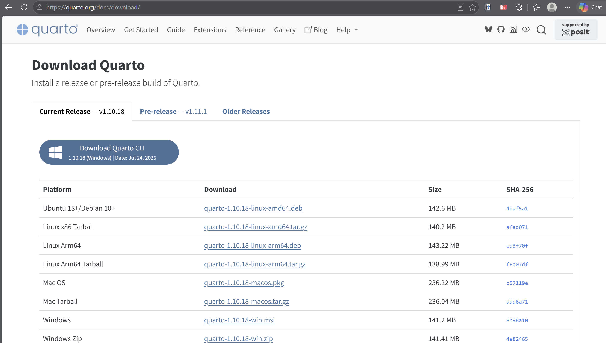
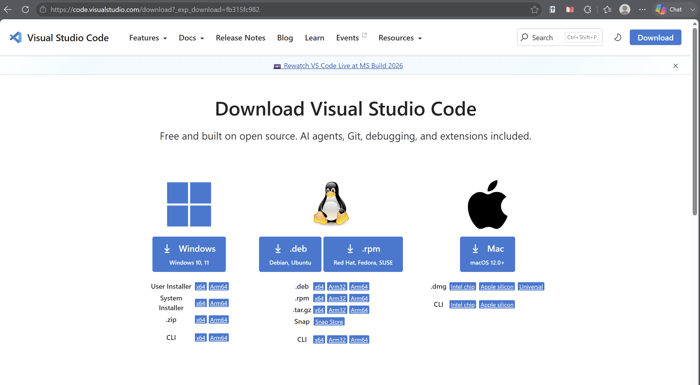
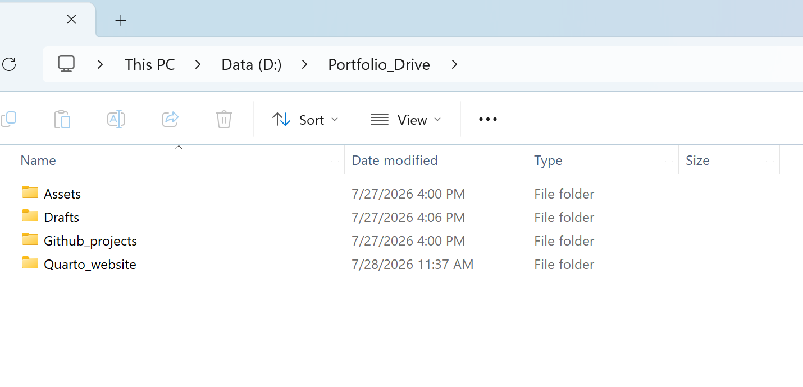
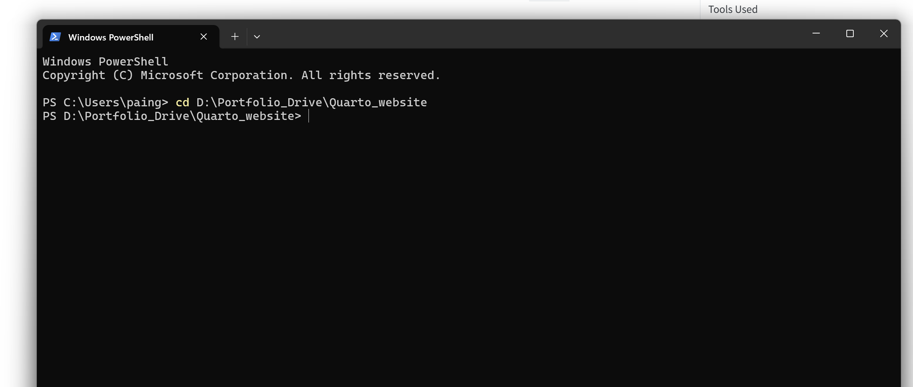
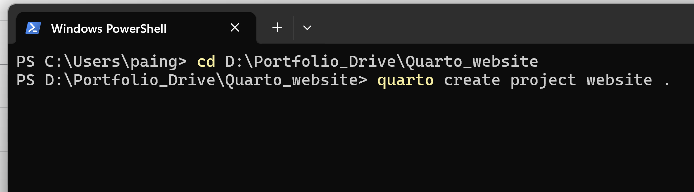
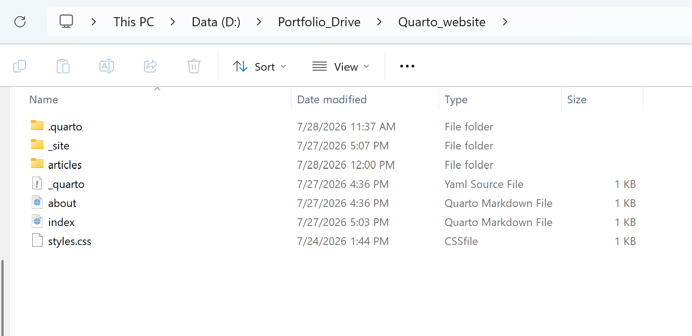
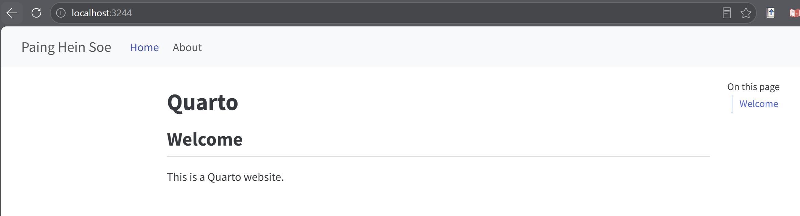

## Welcome! 👋

Have you been thinking about creating your own website to showcase your work, share projects, publish articles, or document what you are learning?

That is exactly what we are going to begin building together.

Getting started with Quarto is not difficult. However, the first setup can feel a little confusing because several tools are involved. We may naturally wonder:

- What does Quarto actually do?
- Why do we need Visual Studio Code?
- What are we using PowerShell for?
- What does `quarto preview` mean?
- Has the website already been published when it opens in a browser?

These are completely normal questions.

In this guide, we will take the process one step at a time. We will not only copy commands—we will understand what each tool does, why we need it, and what we should expect to see after every step.

By the end, we will have a simple Quarto website running on our computer and a clear foundation for building a professional portfolio.

Although this guide demonstrates the setup on **Windows**, the overall workflow is almost identical on **macOS**. If you're a Mac user, you can still follow along—the tools, concepts, and steps remain essentially the same, with only a few operating-system differences.

::: {.callout-note title="Quarto is useful for more than portfolios"}
Although we are creating a portfolio website in this guide, the same setup can also be used to publish articles, present research, document projects, share ideas, or build a personal website.
:::

**Estimated time:** 15 minutes

## What We Will Build 🎯

By the end of this guide, we will have:

- installed the tools needed to work with Quarto;
- created a dedicated website project;
- understood the files Quarto creates for us;
- edited the website using Visual Studio Code;
- previewed the website safely on our own computer;
- prepared the foundation for publishing it online later.

No previous web-development experience is required. We will keep everything practical, clear, and beginner-friendly.

## The Three Tools We Will Use 🧰

Before starting, let us understand the role of each tool. Once these roles are clear, the entire process becomes much easier to follow.

| Tool | What it does in this guide |
|---|---|
| **Quarto** | Builds the website by converting our `.qmd` writing files into webpages. |
| **Visual Studio Code** | Provides the workspace where we write, edit, organize, and manage the website files. |
| **Windows PowerShell** | Lets us send instructions to Quarto, such as creating the website project and starting a local preview. |

Think of the workflow this way:

```text
We write in VS Code
        ↓
PowerShell tells Quarto what to do
        ↓
Quarto builds the website
        ↓
The browser shows the result
```

::: {.callout-tip title="Do we need to learn web programming first?"}
No. We will write mostly in Quarto Markdown, which is much simpler than building a website directly with HTML, CSS, and JavaScript.
:::

## Step 1 — Install Quarto and Visual Studio Code

We first need two applications:

1. **Quarto**, which will build the website.
2. **Visual Studio Code**, which we will use as our main writing and editing workspace.

### Install Quarto

Open the [official Quarto download page](https://quarto.org/docs/download/) and download the installer for your operating system.

This guide uses Windows, so we will choose the Windows installer.

{fig-alt="Quarto download webpage showing the Windows installer" width="90%" fig-align="center"}

::: {.callout-tip title="Which Windows file should we choose?"}
For a normal Windows installation, the `.msi` installer is generally the simplest option. Open the downloaded file and follow the installation instructions.
:::

### Install Visual Studio Code

Next, open the [official Visual Studio Code download page](https://code.visualstudio.com/Download) and choose the Windows version.

{fig-alt="Visual Studio Code download webpage with Windows, Linux, and Mac options" width="90%" fig-align="center"}

Visual Studio Code is not the program that builds the website. It is the workspace where we will open, write, and manage our website files.

::: {.callout-important title="The roles are different"}
**Quarto builds the website.**  
**VS Code is where we work on it.**

Keeping this distinction in mind will make the next steps much clearer.
:::

::: {.callout-note title="After installation"}
If PowerShell was already open while installing Quarto, close and reopen it. This allows Windows to recognize the newly installed `quarto` command.
:::

### Checkpoint ✅

At this stage, we should have:

- Quarto installed;
- Visual Studio Code installed;
- access to Windows PowerShell.

Great—we now have the tools we need. Next, we will create a clean folder where our website can live.

## Step 2 — Create a Workspace for Your Portfolio

**What you'll achieve:** Create a dedicated location to keep your website organized from the beginning.

Before creating the website, it's a good idea to prepare a workspace where all of your portfolio projects can live.

Although you could save the project anywhere, using a dedicated folder keeps everything organized and makes future projects much easier to manage.

For example, I created the following structure:

{width="85%" fig-align="center"}

In this guide, my website is stored inside:

```text
D:\Portfolio_Drive\Quarto_website
```

You can choose a different location if you prefer. The important idea is to keep your projects together rather than scattering them across different folders.

::: {.callout-tip title="A small habit that saves time later"}

As you build more websites, notebooks, or research projects, having a dedicated workspace makes everything easier to find and maintain.

:::

### Checkpoint ✅

At this stage, we should have a folder ready for our Quarto website.

---

## Step 3 — Create Your First Quarto Website

**What you'll achieve:** Generate your first Quarto website and understand the files Quarto creates.

Now we're ready to let Quarto create the website for us.

### Open Windows PowerShell

Open **Windows PowerShell** and navigate to the folder you created.

For example:

```bash
cd D:\Portfolio_Drive\Quarto_website
```

The `cd` command stands for **change directory**. It simply tells PowerShell which folder we want to work in.

{width="90%" fig-align="center"}

Once you're inside the correct folder, run:

```bash
quarto create project website .
```

{width="90%" fig-align="center"}

Let's briefly understand what this command means.

| Part | Meaning |
|------|---------|
| `quarto` | Runs the Quarto program. |
| `create` | Creates something new. |
| `project` | Creates a complete project instead of a single file. |
| `website` | Specifies that the project will be a website. |
| `.` | Creates the website in the current folder. |

::: {.callout-note title="What did Quarto just create?"}

Quarto automatically generated several files for us.

- **index.qmd** — the homepage.
- **about.qmd** — a second page for introducing yourself.
- **quarto.yml** — the website configuration.
- **styles.css** — optional custom styling.

Don't worry about learning these files all at once. We'll become familiar with them naturally as we continue building the website.

:::

### Checkpoint ✅

Congratulations! You now have a working Quarto website project.

---

## Step 4 — Open and Preview the Default Website

**What you'll achieve:** Open the project in Visual Studio Code, preview the default website, and understand how `index.qmd` becomes the homepage.

Open **Visual Studio Code**, then select:

**File → Open Folder...**

Choose your `Quarto_website` folder.

The project files should now appear in the **Explorer** panel on the left.

{width="90%" fig-align="center"}

### Preview the website

Open the terminal in Visual Studio Code, or return to PowerShell, and run:

```bash
quarto preview
```

Quarto builds the website and opens it in your browser.

Your browser should now display the default website created by Quarto.

{width="90%" fig-align="center"}

::: {.callout-note title="What does localhost mean?"}

The website is currently running only on your own computer.

It has not been published online yet.

Later, we'll publish it online using GitHub Pages.

:::

### Compare the Source File with the Homepage

Now open **`index.qmd`** in Visual Studio Code.

You should see content similar to the following (the exact wording may vary slightly depending on your Quarto version):

```markdown
---
title: "Quarto"
---

## Welcome

This is a Quarto website.
```

This is the source file that generates the homepage.

Compare the file above with the webpage shown in your browser.

Notice how the content in `index.qmd` appears on the webpage:

| In `index.qmd` | On the homepage |
|----------------|-----------------|
| `title: "Quarto"` | The page title |
| `## Welcome` | The main heading |
| `This is a Quarto website.` | The paragraph below the heading |

This relationship is one of the most important ideas to understand when working with Quarto.

Every webpage starts as a **`.qmd`** file.

When you run:

```bash
quarto preview
```

Quarto converts that `.qmd` file into a webpage and displays it in your browser.

The workflow looks like this:

```text
index.qmd
      ↓
quarto preview
      ↓
Quarto builds the webpage
      ↓
The browser displays the result
```

::: {.callout-tip title="Think of it this way"}

Think of **`index.qmd`** as the source document.

Whenever you edit and save this file while `quarto preview` is running, Quarto automatically rebuilds the webpage and refreshes your browser.

:::

### Checkpoint ✅

At this stage, we should understand that:

- `index.qmd` is the homepage source file;
- `quarto preview` builds and displays the website;
- the browser is showing a local preview, not a published website.

Next, we'll edit `index.qmd` and watch the homepage change.

---

## Step 5 — Personalize Your Homepage

**What you'll achieve:** Replace the default homepage with your own introduction and watch Quarto update the website automatically.

Now let's replace the default homepage with our own introduction.

Open **`index.qmd`** and replace its content with the following example:

```markdown
---
title: "Welcome"
---

# Hello, I'm Paing Hein Soe 👋

I'm a Mechanical and Energy Engineer with interests in:

- Energy systems
- Artificial intelligence
- Data analytics
- Renewable energy
- Research

This website is where I share my projects, articles, and learning journey.

Thanks for visiting!
```

Save the file by pressing:

```text
Ctrl + S
```

Since `quarto preview` is still running, Quarto automatically detects the change, rebuilds the website, and refreshes the browser.

Your homepage should now look similar to the following:

{width="90%" fig-align="center"}

Notice how your changes in `index.qmd` are immediately reflected in the browser.

The workflow is now:

```text
Edit index.qmd
      ↓
Save the file
      ↓
Quarto automatically rebuilds the page
      ↓
The browser refreshes with the updated homepage
```

::: {.callout-tip title="No need to run `quarto preview` again"}

As long as `quarto preview` is still running, simply save your file whenever you make changes.

Quarto automatically rebuilds the website and refreshes the browser for you, making it easy to see your updates immediately.

:::

::: {.callout-note title="Make it your own"}

The example above uses my background for demonstration purposes.

When creating your own portfolio, replace the text with your own introduction, interests, projects, or professional background. The goal is to understand the editing process—not to copy the exact content.

:::

### Checkpoint ✅

🎉 You have now:

- opened the website project in Visual Studio Code;
- previewed the default Quarto website;
- understood how `index.qmd` controls the homepage;
- edited the homepage;
- seen the website update automatically.

You have completed the basic Quarto workflow.

---

## Where to Go Next 🚀

Now that your website is running successfully, you're ready to continue building it.

In the next guides, we'll cover:

- Publishing your website with GitHub Pages *(Coming Soon)*
- Writing your first Quarto article *(Coming Soon)*
- Customizing your homepage *(Coming Soon)*
- Adding images and navigation *(Coming Soon)*

---

## Connect with Me

I hope this guide helped you build your first Quarto website with confidence.

If you'd like to follow my learning journey or connect professionally, feel free to reach out.

- 💼 LinkedIn: <https://www.linkedin.com/in/paing-hein-soe/>
- 💻 GitHub: <https://github.com/paingheinsoe>

As I continue learning and building projects in energy systems, AI, data analytics, and software tools, I'll keep sharing practical guides like this one.