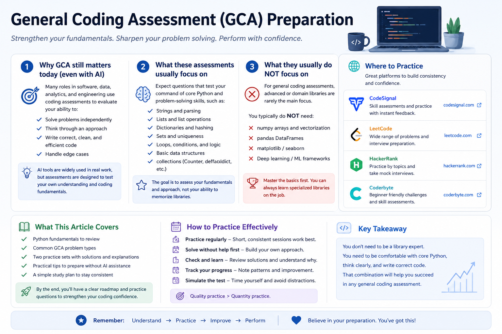

Many software, data analytics, technical analyst, and engineering-adjacent roles now involve some form of coding assessment during the job application or interview process.

At the same time, the way many people write code has changed. In real work, it is normal to use documentation, search, autocomplete, examples, or AI tools. But in a timed assessment, those supports may be limited or not allowed.

That is why a general coding assessment can feel different from normal project work.

It is not only testing whether you can eventually build something. It is testing whether you can:

- understand a small problem quickly;
- choose a reasonable coding approach;
- use basic data structures correctly;
- write clean Python without heavy support;
- handle simple edge cases under time pressure.

This article is a practical preparation guide. It is not a complete algorithms handbook, and it does not reproduce any company-specific test. Instead, it focuses on the Python fundamentals and common problem patterns that are easy to forget when you are working without AI.

::: {.callout-note title="What this article covers"}
This article covers Python basics, common coding-assessment patterns, where to practice, and two short practice sets. The goal is to help you prepare for situations where you need to code independently during a hiring process.
:::

{fig-alt="A clean diagram showing a coding assessment preparation loop with review, practice, and review steps" fig-align="center" width="95%"}

## 1. Why coding assessments still matter in the AI era

AI can be very useful for learning, debugging, and exploring alternatives. But an assessment is a different environment.

A company may use a coding assessment to check whether you can reason through a problem independently. They may not expect advanced software architecture, but they do want to see basic fluency.

For example, can you:

- parse a string correctly?
- update a dictionary count?
- loop through a list without off-by-one mistakes?
- check whether a value exists?
- write a function that handles repeated values or empty input?

These are small skills, but under time pressure they matter.

The goal is not to reject AI. The goal is to prepare for a setting where you may not be allowed to use it.

## 2. What these assessments usually test

A general coding assessment often focuses on practical fluency rather than advanced theory.

Common skills include:

| Skill | What it means in practice |
|---|---|
| String handling | slicing, splitting, joining, checking characters |
| Lists | indexing, appending, sorting, looping |
| Dictionaries | counting, lookup, grouping |
| Sets | checking membership and removing duplicates |
| Loops and conditions | building logic step by step |
| Matrix/list-of-lists | using row and column indices correctly |
| Edge cases | empty input, repeated values, missing values, out-of-bounds cases |

You do not need to know every advanced algorithm first. But you should be comfortable with these basics.

## 3. What they usually do not focus on first

For many general assessments, especially beginner or early-career screens, you should not assume that the test is mainly about advanced libraries.

In normal data work, you might use:

- `numpy`
- `pandas`
- `matplotlib`
- scikit-learn
- specialized APIs

But in a basic coding assessment, the expectation is often closer to:

- built-in Python types;
- loops and conditions;
- strings and lists;
- dictionaries and sets;
- basic standard-library tools such as `collections.Counter` or `collections.defaultdict`.

That means it is useful to practice without relying on `pandas` or `numpy` unless the assessment instructions explicitly allow or require them.

A good rule:

> **For general coding assessments, first become fluent with core Python. Use advanced libraries only when the problem or platform clearly expects them.**

## 4. Where to practice

You do not need to use every platform. Pick one or two and practice consistently.

| Platform | How I would use it |
|---|---|
| [CodeSignal](https://codesignal.com/) | Useful if your assessment is on CodeSignal or you want to become familiar with assessment-style coding environments. |
| [LeetCode](https://leetcode.com/) | Useful for structured interview-style practice, especially by topic and difficulty. |
| [HackerRank](https://www.hackerrank.com/) | Useful for beginner-friendly coding practice and timed challenge formats. |
| [Coderbyte](https://coderbyte.com/developers) | Useful for coding challenges and interview-preparation style practice. |

The platform matters less than the practice method.

For this type of preparation, try this sequence:

1. Solve without AI first.
2. Keep a timer.
3. Write your own test cases.
4. Review after the attempt.
5. Use AI or notes only after you have tried.

## 5. Python fundamentals to review first

Before solving many practice problems, review the small Python operations that appear again and again.

### Strings

```python
s = "hello"

len(s)          # 5
s[0]            # 'h'
s[-1]           # 'o'
s[1:4]          # 'ell'
list(s)         # ['h', 'e', 'l', 'l', 'o']
```

Common string operations:

```python
text = "3:hello"

parts = text.split(":", 1)
index = int(parts[0])
word = parts[1]

"".join(["a", "b", "c"])   # "abc"
```

Use `split(":", 1)` when you only want to split on the first delimiter.

### Lists

```python
nums = [4, 1, 3]

nums.append(2)
sorted_nums = sorted(nums)
nums.sort()
```

Remember the difference:

```python
sorted(nums)   # returns a new sorted list
nums.sort()    # changes the existing list
```

### Dictionaries

Dictionaries are common in coding assessments because they support fast lookup.

```python
freq = {}

for value in [1, 2, 1, 3, 2, 1]:
    freq[value] = freq.get(value, 0) + 1

print(freq)    # {1: 3, 2: 2, 3: 1}
```

Useful dictionary loop:

```python
for key, value in freq.items():
    print(key, value)
```

### `Counter`

For frequency problems, `Counter` is often cleaner.

```python
from collections import Counter

freq = Counter("success")
print(freq)
```

This counts how many times each character appears.

### `defaultdict`

When grouping values, `defaultdict(list)` can reduce extra checks.

```python
from collections import defaultdict

groups = defaultdict(list)

for word in ["eat", "tea", "tan"]:
    key = "".join(sorted(word))
    groups[key].append(word)
```

### Sets

Sets are useful for membership checks and unique values.

```python
seen = set()

seen.add("apple")

if "apple" in seen:
    print("found")
```

A set does not preserve duplicate values.

### Matrices / list-of-lists

A matrix is often represented as a list of lists.

```python
M = [
    [1, 2, 3],
    [4, 5, 6]
]

rows = len(M)
cols = len(M[0])

M[0][2]   # 3
```

Important syntax:

```python
M[0][2]   # correct
M[0, 2]   # not correct for a normal Python list-of-lists
```

## 6. How to prepare without AI

The goal is not to avoid AI forever. The goal is to prepare for the specific situation where AI is not allowed.

A practical routine:

1. Review the Python basics above.
2. Solve small problems without AI.
3. Use a timer.
4. Write a few test cases yourself.
5. After finishing, use AI or notes only to review what you missed.

During practice, ask yourself:

- Did I understand the input and output?
- Did I choose the right data structure?
- Did I test edge cases?
- Could I explain my solution in plain English?
- Could I write it again tomorrow without looking?

## 7. Common question types

Many general coding assessment problems can be grouped into a few patterns.

| Type | Typical idea |
|---|---|
| String parsing | split, slice, convert, extract |
| Frequency counting | count characters, words, or numbers |
| Matrix/simulation | move through a grid or process rows/columns |
| Query processing | update a collection and answer after each operation |

The practice sets below follow those four types.

## 8. Practice Set A

Try these without AI first. After attempting, compare your approach with the solution.

### A1. Extract characters from indexed strings

You are given a list of strings. Each string has the form `"index:word"`.

For each item:

- read the number before `:`;
- use it as an index into the word after `:`;
- if the index is valid, collect that character;
- otherwise collect `"?"`.

Return the collected characters as one string.

Example:

```text
Input:  ["0:hello", "2:world", "5:hi"]
Output: "hr?"
```

#### Solution

```python
def extract_indexed_chars(items):
    result = []

    for item in items:
        left, word = item.split(":", 1)
        idx = int(left)

        if 0 <= idx < len(word):
            result.append(word[idx])
        else:
            result.append("?")

    return "".join(result)


print(extract_indexed_chars(["0:hello", "2:world", "5:hi"]))
# "hr?"
```

What this tests:

- splitting strings;
- converting string to integer;
- checking index bounds;
- joining a list of characters.

### A2. Most common letter type

Given a lowercase string, find:

- the highest frequency of any vowel;
- the highest frequency of any consonant.

Return the sum of those two frequencies. If one group is missing, count it as `0`.

Example:

```text
Input:  "success"
Output: 4
```

Explanation:

- vowels: `u` appears 1 time, `e` appears 1 time → max vowel frequency = 1
- consonants: `s` appears 3 times, `c` appears 2 times → max consonant frequency = 3
- answer = 1 + 3 = 4

#### Solution

```python
from collections import Counter

def max_vowel_plus_consonant(s):
    vowels = set("aeiou")
    freq = Counter(s)

    max_vowel = 0
    max_consonant = 0

    for ch, count in freq.items():
        if ch in vowels:
            max_vowel = max(max_vowel, count)
        else:
            max_consonant = max(max_consonant, count)

    return max_vowel + max_consonant


print(max_vowel_plus_consonant("success"))
# 4
```

What this tests:

- `Counter`;
- dictionary-style looping;
- separating values by condition;
- tracking maximum values.

### A3. Row totals after movement

You are given a matrix. For each row, start at column `0` and move to the right until the end of the row. Add all values in that row and return the list of row sums.

Example:

```text
Input:
[
  [1, 2, 3],
  [4, 5, 6]
]

Output: [6, 15]
```

#### Solution

```python
def row_sums(matrix):
    result = []

    for row in matrix:
        total = 0
        for value in row:
            total += value
        result.append(total)

    return result


print(row_sums([[1, 2, 3], [4, 5, 6]]))
# [6, 15]
```

What this tests:

- nested loops;
- list-of-lists;
- accumulating totals.

A shorter Python version is:

```python
def row_sums(matrix):
    return [sum(row) for row in matrix]
```

But in an assessment, the longer version can be easier to reason about when problems become more complex.

### A4. Process add/remove queries

You are given a list of queries.

Each query is one of:

- `"+x"`: add number `x`;
- `"-x"`: remove one occurrence of number `x` if it exists.

After each query, return the number of unique values currently stored.

Example:

```text
queries = ["+1", "+2", "+1", "-1"]
Output: [1, 2, 2, 2]
```

Explanation:

```text
+1 → [1]        unique count = 1
+2 → [1, 2]     unique count = 2
+1 → [1, 2, 1]  unique count = 2
-1 → [2, 1]     unique count = 2
```

#### Solution

```python
from collections import Counter

def unique_counts_after_queries(queries):
    freq = Counter()
    result = []

    for q in queries:
        op = q[0]
        value = int(q[1:])

        if op == "+":
            freq[value] += 1
        else:
            if freq[value] > 0:
                freq[value] -= 1
                if freq[value] == 0:
                    del freq[value]

        result.append(len(freq))

    return result


print(unique_counts_after_queries(["+1", "+2", "+1", "-1"]))
# [1, 2, 2, 2]
```

What this tests:

- parsing query strings;
- using `Counter`;
- updating state over time;
- deleting keys when counts reach zero.

## 9. Practice Set B

This second set uses similar skills but changes the problem wording.

### B1. Clean and reverse words

Given a sentence, split it into words and return the words in reverse order as one string.

Example:

```text
Input:  "data energy climate"
Output: "climate energy data"
```

#### Solution

```python
def reverse_words(sentence):
    words = sentence.split()
    words.reverse()
    return " ".join(words)


print(reverse_words("data energy climate"))
# "climate energy data"
```

What this tests:

- `split`;
- list reversal;
- `join`.

### B2. First repeated number

Given a list of integers, return the first number that appears twice. If no number repeats, return `None`.

Example:

```text
Input:  [4, 2, 7, 2, 4]
Output: 2
```

#### Solution

```python
def first_repeated(nums):
    seen = set()

    for num in nums:
        if num in seen:
            return num
        seen.add(num)

    return None


print(first_repeated([4, 2, 7, 2, 4]))
# 2
```

What this tests:

- sets;
- membership checking;
- early return.

### B3. Count values above row average

Given a matrix, return a list where each value is the number of elements in that row greater than the row average.

Example:

```text
Input:
[
  [1, 2, 6],
  [4, 4, 4],
  [10, 1, 1]
]

Output: [1, 0, 1]
```

#### Solution

```python
def count_above_row_average(matrix):
    result = []

    for row in matrix:
        avg = sum(row) / len(row)
        count = 0

        for value in row:
            if value > avg:
                count += 1

        result.append(count)

    return result


matrix = [
    [1, 2, 6],
    [4, 4, 4],
    [10, 1, 1]
]

print(count_above_row_average(matrix))
# [1, 0, 1]
```

What this tests:

- matrix traversal;
- average calculation;
- conditions inside loops.

### B4. Running stock count

You manage a small inventory. Each query is:

- `"add:item"` — add one item;
- `"sell:item"` — sell one item if available.

After each query, return the total number of items currently in inventory.

Example:

```text
queries = ["add:book", "add:pen", "add:book", "sell:book"]
Output: [1, 2, 3, 2]
```

#### Solution

```python
from collections import Counter

def inventory_total_after_queries(queries):
    inventory = Counter()
    total = 0
    result = []

    for q in queries:
        op, item = q.split(":", 1)

        if op == "add":
            inventory[item] += 1
            total += 1
        else:
            if inventory[item] > 0:
                inventory[item] -= 1
                total -= 1
                if inventory[item] == 0:
                    del inventory[item]

        result.append(total)

    return result


queries = ["add:book", "add:pen", "add:book", "sell:book"]
print(inventory_total_after_queries(queries))
# [1, 2, 3, 2]
```

What this tests:

- string parsing;
- dictionary state;
- running totals;
- safe removal.

## 10. How to review your solutions

After solving a problem, do not only ask whether the answer matches one example.

Check these:

| Review question | Why it matters |
|---|---|
| Does it handle empty input? | Many tests include edge cases |
| Does it handle repeated values? | Counting problems often depend on this |
| Does it handle missing values? | Query problems often include removals that may not exist |
| Can I explain the logic? | Interviewers may ask you to walk through your thinking |
| Is the code readable? | Simple correct code is better than clever broken code |

A simple preparation rule:

> **First make it correct. Then make it cleaner. Only optimize if the problem size requires it.**

## 11. Final takeaways

A general coding assessment does not always require advanced algorithms first.

For many entry-level or general assessments, a large part of the challenge is being fluent with:

- strings;
- lists;
- dictionaries;
- sets;
- loops;
- simple matrix logic;
- edge cases;
- clean step-by-step implementation.

AI can be useful for learning and reviewing afterward. But if the assessment does not allow AI, you need enough independent fluency to solve small problems on your own.

That fluency comes from focused practice, not from memorizing hundreds of solutions.
